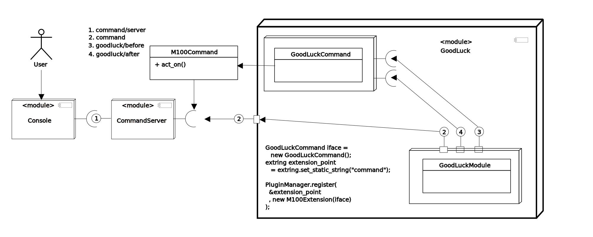

Good Luck Module
=================

'Good luck' module is simple module to demonostrate module writing. Note that there are kinds of modules, while this module is dynamic. This module acts as the skeleton module too.

```
 a/shotodol$ ls apps/good_luck
```

Creating a custom module
=========================

It may be convenient to copy this module in `apps`(favorablly) directory in different name and start changing.

```
 a/shotodol$ cp -rf apps/good_luck apps/hello_world
```

Now the apps/hello_world directory contains all the files needed for a module.

```
 a/shotodol$ ls apps/hello_world
dynalib.so  GoodLuck.dot  include  includes.mk  pkg.depend  README.md  static_objects.a  vapi  vapi.mk  vsrc
```

Each module must contain the following files.

- [pkg.depend](pkg.depend) : This file identifies the modules it depends on.
- [includes.mk](includes.mk) : This file shows the include path. This file does not need to be changed often.
- [vapi.mk](vapi.mk) : It is Makefile to compile vala sources. It contains the library name of the new module. It may be renamed from `shotodol\_good\_luck` to `shotodol\_hello\_world`.

After compilation the module generates the following files,

- dynalib.so : This is the dynamic shared library binary. It is the compiled output. It can be loaded in shotodol by `module -l apps/hello\_world/dynalib.so` command.
- static_object.a : This is the static library binary. It is also a compiled output. It can be statically linked to shotodol, which can be done editing the `build/staticlibs.mk` file.
- include : This directory contains the generated C headers. These headers can be included by the dependent modules while compilation.
- vapi : This directory contains the generated Vala headers. These headers can be included by the dependent modules while compilation.

The generated files are not the primary concern while writing a new module. 

#### Vala files

Each module may contain vala sources in `vsrc` directory.

```
 a/shotodol$ ls apps/hello_world/vsrc
GoodLuckCommand.c  GoodLuckCommand.vala  GoodLuckModule.c  GoodLuckModule.vala
```

The `GoodLuckCommand.c` and `GoodLuckModule.c` are the compiled output. These files are again not the concern while writing a new module.

#### GoodLuckModule.vala

The [GoodLuckModule.vala](vsrc/GoodLuckModule.vala) defines the GoodLuckModule class. GoodLuckModule extends the DynamicModule and overrides `init` and `deinit` methods.

- init() method : It is called when the module is loaded in shotodol. It registers hooks or other extensions in shotodol plugin system. Please refer to [Hooking](../../libs/plugin/Hooking.md) to understand the source.
- deinit() method : It is called when the module is unloaded.
- get_module_instance() method : It is the entrypoint of a dynamic library. It is almost the same for all the modules. 
 

```
 a/shotodol$ gedit apps/hello_world/vsrc/GoodLuckModule.vala
```

After the code is edited, the module needs to be specified in [build/pkg.depend](../../build/pkg.depend) file and shotodol needs to be reconfigured and compiled.

```
 a/shotodol$ echo apps/hello_world >> build/pkg.depend
 a/shotodol$ lua configure.lua
 a/shotodol$ make
```

After running/executing the ./shotodol.bin file, it will prompt for commands. And writing _'module -load apps/hello\_world/dynalib.so'_ will load the module [commands](../../core/commands/README.md). The module will eventually be ready for use. 

```
 a/shotodol$ ./shotodol.bin
	module -load apps/hello_world/dynalib.so
```

Note that the `rehash` command will make the goodluck command available for execution.

```
Loading console spindle
Started idle stepping ..
Started idle stepping ..
rehash   
Executing:rehash
<          rehash> -----------------------------------------------------------------
<      Successful> -----------------------------------------------------------------

module -load apps/good_luck/dynalib.so
Executing:module -load apps/good_luck/dynalib.so
<          module> -----------------------------------------------------------------
<      Successful> -----------------------------------------------------------------

rehash
Executing:rehash
<          rehash> -----------------------------------------------------------------
<      Successful> -----------------------------------------------------------------

help goodluck
Executing:help goodluck
<            help> -----------------------------------------------------------------
goodluck
	     -name		    <text>	Your name
<      Successful> -----------------------------------------------------------------

goodluck -name shotodol
Executing:goodluck -name shotodol
<        goodluck> -----------------------------------------------------------------
Before hook ~~~~ 
Good luck shotodol
Have nice time with shotodol.
After hook ~~~~ 
<      Successful> -----------------------------------------------------------------
```


This _good\_luck_ module reveals a lot of shotodol basics.

Good Luck Command
=================

The [GoodLuckCommand](vsrc/GoodLuckCommand.vala) extends [M100Command](../../libs/make100/vsrc/M100Command.vala) and the command is advertised by GoodLuckModule.

The following diagrams shows the relation among good luck module and other modules.




