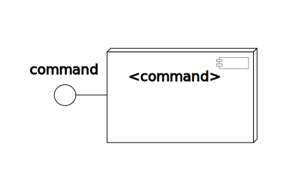

Command
=========

Commands are the instructions for user interaction. A command can be interacted via [console](../console/README.md) or they can be used in [shake script](../shake/README.md). You can put 'help' in console to know the available commands. You can write your own commands too. In that case you need to write an [extension](../../libs/plugin/README.md) in _'command'_ space. Please see the [idle command](../idle/vsrc/IdleCommand.vala) for an example of command.

ModuleCommand
=============
Module command lets you load a dynamic module and also unloading it. Write `help module` for further details.

RehashCommand
=============
Rehash command lets the rehash extensions dispatch in a swarm.

Diagram
========

