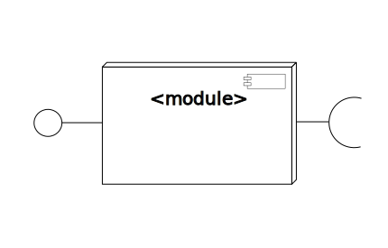
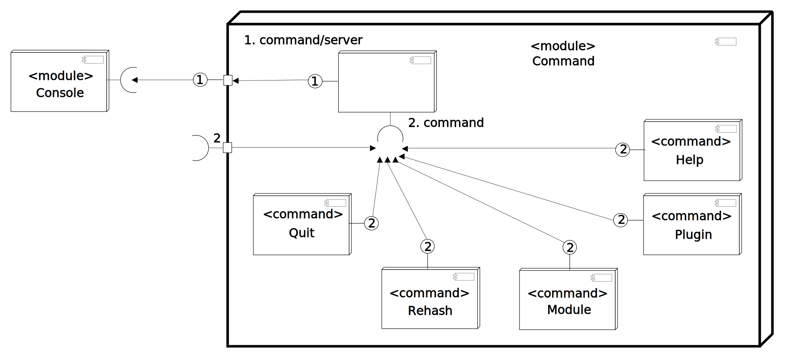

Module
=========

Most of the code done in shotodol are in modules, simply to achieve **[robustness](http://en.wikipedia.org/wiki/Structural_robustness)** by **[separation of concern](http://en.wikipedia.org/wiki/Separation_of_concerns)**. A module is a [group of code](http://en.wikipedia.org/wiki/Encapsulation_%28object-oriented_programming%29) that provides a functional support to the shotodol environment. You can say the following things about shotodol modules,

- _Encapsulation_: Each module is contained in a discrete directory. There are helper _Makefiles_ to build the modules. These scripts are primed for building modules in depth of two directories. For example, you can write modules in apps/good\_luck or core/commands directory. 
- _Loading/unloading_: User may choose to load a module dinamically and unload dinamically. Though there are ways to load static libraries. The idea to load or initiate a module is to let it register the services or add extensions as plugin and do other initialization tasks. This is a way to support lazy initialization too.

Conceptually the modules should achieve more [cohesion](http://en.wikipedia.org/wiki/Cohesion_%28computer_science%29) and low [coupling](http://en.wikipedia.org/wiki/Coupling_%28computer_science%29).

Module Interaction
===================

The modules can communicate with each other. There are several ways to communicate,

### Shake script

_shake_ script provides a way to perform a task on an event. For example, there is an event like, onload. So when shotodol loads itself, it performs the onload tasks. A module can eventually generate events of their own([example yet to come](../../../apps/shakeeventexample/README.md)).

### Plugin/extensions

You can write extensions and use them to communicate through them using interfaces. [Here is how](../../../libs/plugin/README.md).

### Message passing.

The plugins/extensions allow you to write hooks for events. See [hooking and message passing](../../../libs/plugin/Hooking.md).

- [shotodol_architecture](https://cloud.githubusercontent.com/assets/973414/3930915/c45b8232-244e-11e4-9ced-f277e9d48729.jpg)
- [shotodol_architecture](../../diagrams/shotodol_module_plugin_command_shell.svg)
- [shotodol_module_component_command_shell](https://cloud.githubusercontent.com/assets/973414/5547388/059c37fa-8b83-11e4-85e4-011b8210a619.jpg)

In the diagram above, _Quit_, _Module_, _Plugin_, _Help_, _Rehash_ are registered as commands in _plugin_ system. _Command server_ makes them available for use as instructions in _command/server_ extension point. And _Console module_(interactive shell) uses the _command server_ to access the commands.

Builtin Modules
===============

Shotodol comes with some builtin modules to support more extensions. These modules are namely,

### Basic modules

- [module](../../../libs/module/README.md)
- [plugin](../../../libs/plugin/README.md)
- [make100](../../../libs/make100/README.md)
- [Command](../../../core/commands/README.md)

### Configuration modules

- [config](../../../libs/config/README.md)

### Concurrency/process/thread management modules

- [fiber](../../../libs/fiber/README.md)
- [spinningwheel](../../../libs/spinningwheel/README.md)
- [fork](../../../core/fork/README.md)

### Testing and benchmarking modules

- [profiler](../../../core/profiler/README.md)
- [unittest](../../../libs/unittest/README.md)
- [benchmark](../../../libs/benchmark/README.md)
- [watchdog](../../../libs/watchdog/README.md)

### IO modules

- [iostream](../../../libs/iostream/README.md)

### Scripting modules

- [Shotodol Script](https://github.com/kamanashisroy/shotodol_script)
- [shake](../../../core/shake/README.md)

### Packeting modules

- [bundle](../../../libs/bundle/README.md)

### Unsorted modules

- [str\_arms](../../../libs/str_arms/README.md)
- [iterator](../../../libs/iterator/README.md)
- [alias](../../../apps/alias/README.md)

### Instrumentation modules

- [profiler](../../../core/profiler/README.md)
- [watchdog](../../../libs/watchdog/README.md)

### Packaging modules

- [instant](../../../apps/instant/README.md)

User module
============

User modules have the same potential as the builtin modules. But the point is, they are not part of the shotodol core and they are written on demand. [Here](../../../libs/module/README.md) is more about writing an user module.

