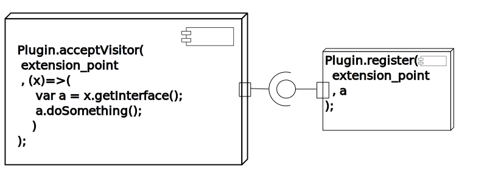
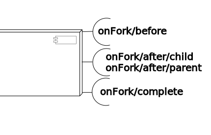

The idea of a diagram is to reduce cognitive load and cognitive dissonance. Here two standardized diagrams are used to investigate the project.

- [Class diagram](#Class_diagram)
- [Component diagram](#Component_diagram)

#### Class diagram

There are some class diagrams added to shotodol project for better understanding.

The above diagram shows the relation between differnt [fiber](../../libs/fiber)s.

#### Component diagram

Components here represent modules. It may also indicate any [M100Command](../../libs/make100) interface. 

The lollipop in the component diagram below is the plugin extension point.

The half circular hub drawn above is the traversals of the extensions, ie, this is the place where the extensions are plugged.

The above diagram shows the available [commands](../../core/commands) and user [interaction](../../core/console).

The above diagram shows the method of [spawning child process](../../core/fork).

#### Other diagrams

All the svg diagrams are in [docs/diagrams](./) directory.
