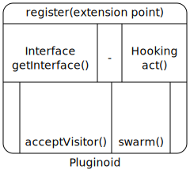

Plugin
=========
Plugin lets you write ready to use named extensions. You put your extension in named list using register() function. Other plugins can use that extension to do certain tasks.

Plugin techniques
==================
[Pluginoid](pluginoid.dot)



### Extension
_Extension_ is a way to associate your facility to a plugin space. Each plugin _space_ is a string. Suppose if you want to write a _command_ then you need to register an _extension_ in space named _'command'_ . All the extensions have an _act()_ method available for communication.

### Interface
_Interface_ in an _extension_ is an _object_ returned by getInterface() method. You can type-cast this _object_(Replicable) into something that meet your purpose. Interface here allows better performance. Once a _plugin_ registers an _interface_ it is mapped when _rehash_ is done. For example, the commands module loads all the commands under the name space "command" and makes them available for user.

### rehash
Rehash is an event. This event is generated from [rehash command](../../core/commands/README.md#RehashCommand). It asks everyone to get the extensions from plugin name space and get the insterface for future use. Rehash is done normally after a module load or unload. (May be we need to do rehash when there is any change in plugin)

### Hooking
You can write a [hook function](Hooking.md) for an event.

Example
========
The _'idle'_ module is a good example of plugin. It registers as _command_. And eventually the command is available in the console.

Examine plugins
================
The plugin command enables us to see the loaded extensions and associated modules.

### Listing
```
plugin -x command
```
The above command will show all the registered commands. 

### Dispatch
You can dispatch an event on your own using plugin command.
```
plugin -x onQuit -act
```
The above command will execute the extensions/hooks in _'onQuit'_ name space.

Loading and unloading plugins
==============================
Plugins are loaded when the module is loaded. But you can disable/enable a plugin using commands. (well it is not yet implemented at the time of writing this README, it should be something like `plugin -x plspace -dis`) . See the [module command](../../core/commands/README.md#ModuleCommand).

Readings
========

- External coupling
- Message passing
- [Interface](http://en.wikipedia.org/wiki/Interface_%28computing%29)
- [Hook](http://en.wikipedia.org/wiki/Hooking)
- [nixysa](https://code.google.com/p/nixysa/wiki/HelloWorldWalkThru)

